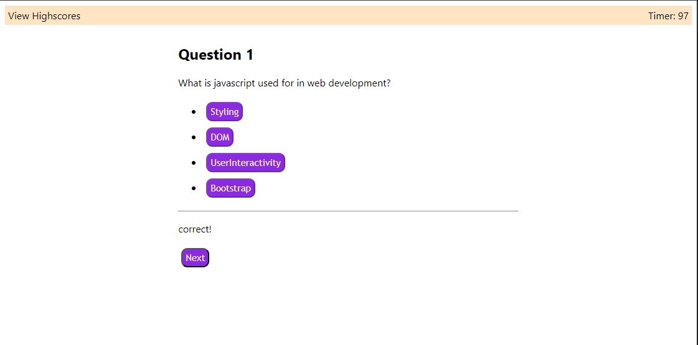

# JavaScript Quiz Application

The Javascript Quiz Application was created to apply the use of webAPI knowledge to build a working quiz game.

The quiz consists of multiple screens and buttons to carry out the process. It can also store high scores and display to the score screen.

A start button click starts the timer and takes the user to the question screen, where all questions will be asked and feedback will be given on the provided answers. Both the timer running out or all questions being answered will trigger the end screen to display the score and allow user to submit their scores. Finally a score screen will appear logging the previous user quiz runs.

## Features

- user-friendly layout
- multiple buttons to carry the flow of the quiz
- timer interval for the quiz
- questions with respective answer buttons and feedback on the correct/wrong entries
- at end screen, user score is displayed and a form to input user name and submit.
- info stored in the local storage and retrieved from it
- highscore screen displays the scores and allows for the user to clear the entries.

## Appendix

Images and Icons were used from shutter stock to provide a visual representation of the linked applications.

## API Reference

https://developer.mozilla.org/en-US/

https://developer.mozilla.org/en-US/docs/Web/API

## Authors

- [Syed Kazmi](https://github.com/kazmiali123)

## Deployment

Website URL: https://kazmiali123.github.io/Challange4---Javascript-Quiz/

GitHub Repository: https://github.com/kazmiali123/Challange4---Javascript-Quiz

## Demo

Javascript Quiz Demo Image

